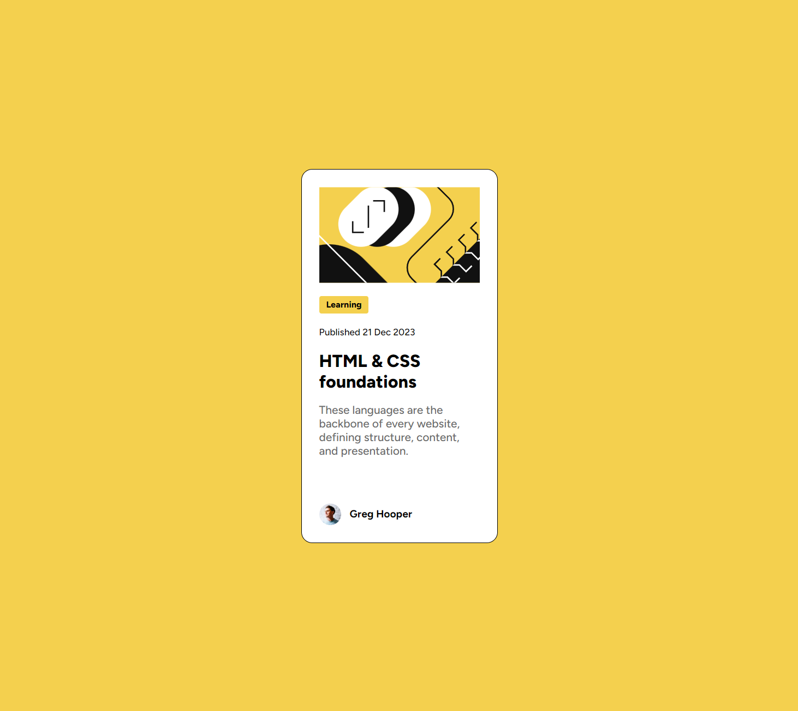

# Frontend Mentor - QR code component solution

Hi, Niels here. This is a solution to the [Blog preview card challenge on Frontend Mentor](https://www.frontendmentor.io/challenges/blog-preview-card-ckPaj01IcS).
[Hosted on GH pages](https://nielsfechtel.github.io/frontendmentor_1_blog_preview_card/).

## Table of contents

- [Frontend Mentor - QR code component solution](#frontend-mentor---qr-code-component-solution)
  - [Table of contents](#table-of-contents)
  - [Overview](#overview)
    - [Screenshot](#screenshot)
    - [What I learned](#what-i-learned)
  - [Author](#author)

## Overview

### Screenshot



### What I learned

Tried using clamp- and max-method for max-, min- and height-values.

```css
height: clamp(min-content, 50vh, 620px);
width: max(12vw, 300px);
```

## Author

- Website - [Niels Fechtel](https://niels-fechtel.com)
